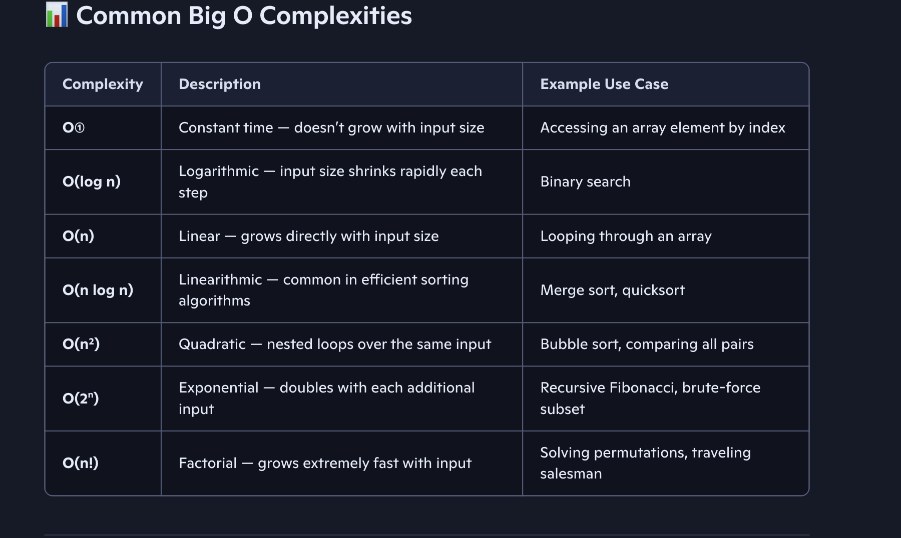
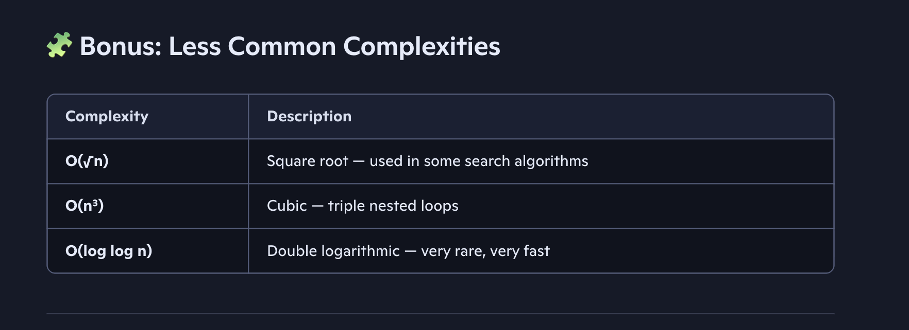

# Big O Notation

## 🧮 What Is Big O?

Big O notation is a mathematical way to describe how the performance of an algorithm scales with input size. It focuses on the worst-case scenario and helps us understand:

Time complexity → how long it takes to run

Space complexity → how much memory it uses

## 🧠 Why Use Big O?

Because it gives us a language to compare algorithms regardless of hardware, programming language, or implementation details.

For example:

O(n) means the algorithm's time grows linearly with input size.

O(n^2) means time grows quadratically — much slower for large inputs.

O(log n) means time grows slowly even as input increases.

## 📌 In Your Case

Time complexity: O(n) Space complexity: O(n + d)

I was using Big O to say:

Your function’s runtime increases linearly with the number of elements.

Its memory usage depends on both the number of elements and the depth of nesting.

## 📊 Common Big O Complexities



## 🧠 How to Measure Complexity

Time Complexity — Count how many operations your algorithm performs relative to input size.

Look at loops, recursion depth, and branching.

Space Complexity — Count how much memory your algorithm uses.

Consider variables, data structures, and recursion stack.

## 🧩 Bonus: Less Common Complexities



# 🧠 Programming Examples by Time Complexity

✅ O(1) – Constant Time

```javascript
Example: Accessing an element in an array

function getFirstElement(arr) {
  return arr[0]; // Always takes constant time
}
```

# 🔍 O(log n) – Logarithmic Time

```js
Example: Binary Search (sorted array)

function binarySearch(arr, target) {
  let left = 0, right = arr.length - 1;
  while (left <= right) {
    const mid = Math.floor((left + right) / 2);
    if (arr[mid] === target) return mid;
    else if (arr[mid] < target) left = mid + 1;
    else right = mid - 1;
  }
  return -1;
}
```

# 🔁O(n) – Linear Time

```js
Example: Finding the maximum element
function findMax(arr) {
  let max = arr[0];
  for (let i = 1; i < arr.length; i++) {
    if (arr[i] > max) max = arr[i];
  }
  return max;
}
```

# O(n log n) – Linearithmic Time

```js
Example: Merge Sort
function mergeSort(arr) {
  if (arr.length <= 1) return arr;
  const mid = Math.floor(arr.length / 2);
  const left = mergeSort(arr.slice(0, mid));
  const right = mergeSort(arr.slice(mid));
  return merge(left, right);
}

function merge(left, right) {
  const result = [];
  while (left.length && right.length) {
    result.push(left[0] < right[0] ? left.shift() : right.shift());
  }
  return result.concat(left, right);
}
```

🔄 O(n²) – Quadratic Time

```js
Example: Bubble Sort

function bubbleSort(arr) {
  for (let i = 0; i < arr.length; i++) {
    for (let j = 0; j < arr.length - i - 1; j++) {
      if (arr[j] > arr[j + 1]) {
        [arr[j], arr[j + 1]] = [arr[j + 1], arr[j]];
      }
    }
  }
  return arr;
}
```

# 🧮 O(2ⁿ) – Exponential Time

```js
Example: Recursive Fibonacci

function fibonacci(n) {
  if (n <= 1) return n;
  return fibonacci(n - 1) + fibonacci(n - 2);
}
```

🧩 O(n!) – Factorial Time

```js
Example: Generating all permutations

  const result = [];
  function backtrack(path, options) {
    if (!options.length) result.push(path);
    for (let i = 0; i < options.length; i++) {
      backtrack(path.concat(options[i]), options.slice(0, i).concat(options.slice(i + 1)));
    }
  }
  backtrack([], arr);
  return result;
}
```

## 🧩 When Do You See O(1)?

Accessing a value by index in an array

Hash table lookup (in ideal conditions)

Setting a variable

Simple arithmetic operations

## 🚫 What O(1) Is Not

If your code loops, recurses, or grows with input — even slightly — it’s not O(1.
